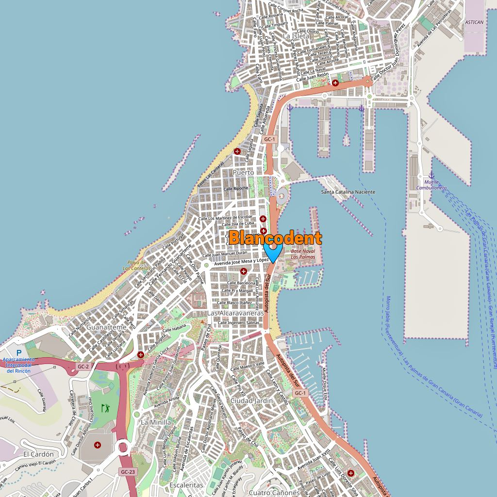

Lo más importante: Enlaces a nuestra ubicación en mapas tanto de Apple como de Google, transporte, guaguas, taxis, aparcamientos cercanos y nuestra dirección física. Pues aquí es donde estamos para lo que te haga falta. :-)

Si eres usuario de mapas de *Google, pues* <a  href="https://www.google.com/maps/place/Cl%C3%ADnica+Dental+Blancodent/@28.134669,-15.429525,17z/data=!4m2!3m1!1s0x0:0x9293d54eccbd51c?hl=en" target="_blank">*pincha aquí*</a> para abrir Google.maps y, si eres usuario de *Apple*, pues le puedes dar tranquilamente <a  href="http://maps.apple.com/maps?address=Av%20Mesa%20y%20L%C3%B3pez,%201%20-%201%C2%AA%20izquierda,%2035006%20Las%20Palmas%20de%20Gran%20Canaria,%20Las%20Palmas,%20Las%20Palmas,%20Spain&auid=4569860911891010439&ll=28.134679,-15.429491&lsp=9902&q=Cl%C3%ADnica%20Dental%20Blancodent&t=m" target="_blank">*a este enlace*</a> para abrir en la app de Apple.

  

## Transporte
A nosotros/as nos parece genial si vienes paseando o cabalgando en una bici, sobre todo ahora, que la calle es peatonal. Y si no, hay una multitud de aparcamientos y paradas de guaguas y taxis cerca. Justo en frente de la clínica hay una parada de guaguas. hay paradas de taxis en la zona aún que ellos paran donde ordenas.
## Paradas guaguas y taxis
Las paradas de taxis están cerca de El Corte Ingles y, si usted viene en la guagua, podrá coger una de estas líneas: Las guaguas que paran en la calle Juan Manuel Duran. OB, 21, 31, 3, 30. O las guaguas que paran por la Avenida Mesa y López. OA, 17, 30, 47, 42, 43. Enlace a Guaguas Municipales con sus planos y horarios: guaguas.com
## Aparcamientos Cercanos
Si usted elige venir a la clínica en coche, puede dejarlo en uno de los siguientes aparcamientos cercanos... Los tres aparcamientos situados en ambos edificio de El Corte Inglés. Calle Juan Manuel Duran 20, llamado Arraiga. Calle Franchy Roca situado en la zona bancaria llamado "Saba". Parking en Plaza de España. Parking en la Calle Barcelona.
## Y, finalmente, nuestra dirección física
Pues aquí es donde estamos para lo que te haga falta. :-)  
Clínica Dental Blancodent S.L.P. Avenida Mesa y López, 1 - 1ª izquierda  
35006 Las Palmas de Gran Canaria  
Islas Canarias, España  
Télefono: +34 928 292 455