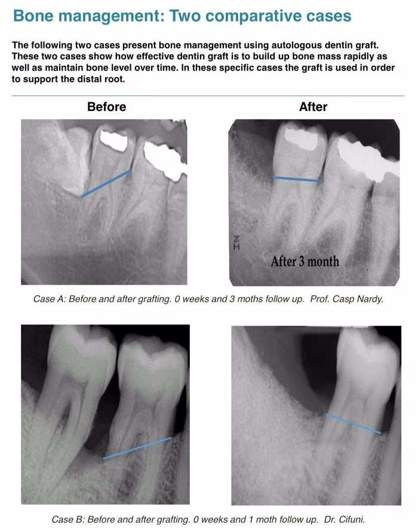

Aprovecha tu propio diente extraído como fuente de biomaterial para mejorar la cicatrización de tu implante. Especialmente indicado para casos en los que no hay suficiente hueso en la mandíbula del paciente, lo que se asocia a un alto riesgo de pérdida del implante.

Este novedoso proceso tecnológico, utilizado en Blancodent, nos permite la posibilidad de usar un biomaterial dental extraído del propio paciente, evitando así utilizar un producto sintético o de origen animal. Con este proceso, la tasa de rechazo es prácticamente cero ya que se trata en un material hecho con el ADN del propio paciente.

Se trata de un aparato denominado “Smart Dentin Grinder (Molino Dentin Inteligente)” que nos permite utilizar nuestro propio diente después de extraerlo. Se prepara para su uso inmediato en el momento de colocar el implante o se puede guardar para el futuro.



## ¿Cómo funciona?

Gracias al proceso patentado SMART GRINDER, el cual ha sido desarrollado por el Prof. Binderman, es posible transformar el diente extraído en un injerto de hueso. 

El grupo del Prof. Binderman ha estandarizado este procedimiento y ha desarrollado el aparato necesario. Nosotros somos una de las clínicas pioneras en traerlo a Canarias.

## El proceso

Primero, los dientes extraídos se limpian, desinfectan y muelen en el aparato. La estructura resultante es de aspecto granulado y se deja moldear adecuadamente, adaptándose a la zona donde no hay suficiente hueso para poner los implantes

## Explicación científica

La composición del diente es casi idéntica a la del hueso humano, en cuanto a iones de calcio y fósforo; 70% son sustancias minerales, 20% componentes orgánicos (especialmente colágeno) y el 10% restante es agua, lo cual hace que sea ideal para ser utilizado como auto injerto.

Este injerto autólogo no provoca reacción inmune, su incorporación es rápida y efectiva, en pocos meses se convierte en hueso.

  

## Referencias científicas:  

<a href="https://www.kometabio.com/scientific-publications" target="_blank">Enlace externo --> </a>
